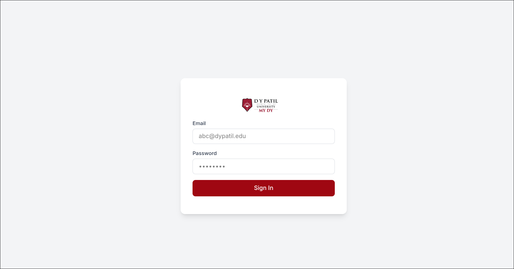
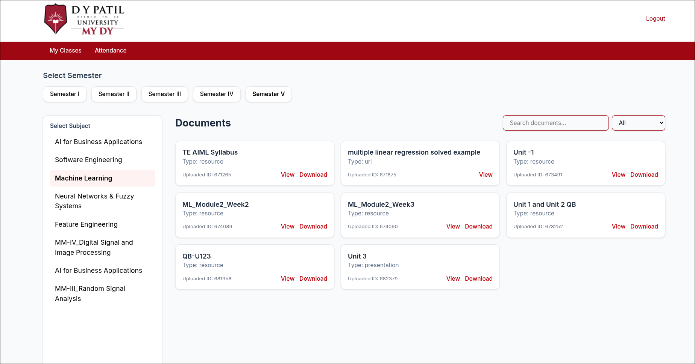
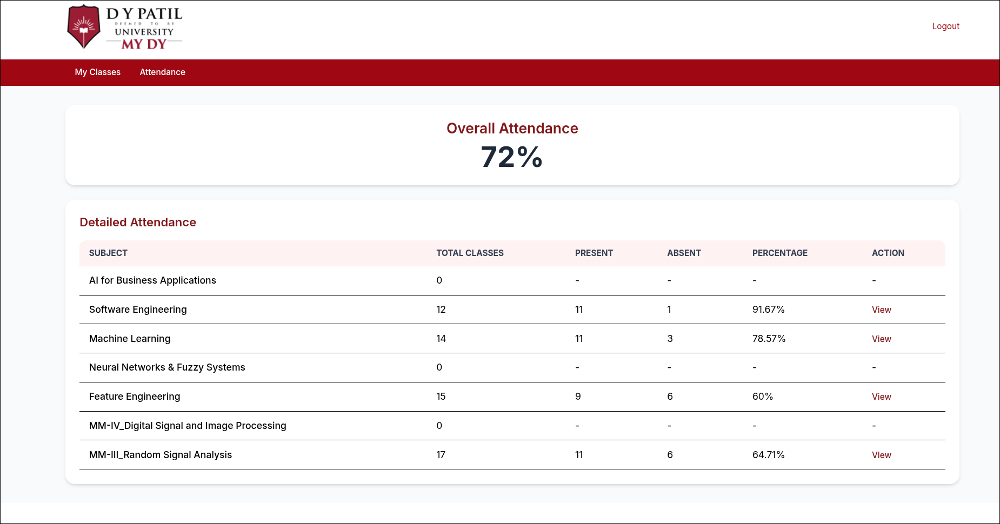

# MYDYLMS Frontend (Unofficial)

**Note:** This is an unofficial frontend for the [mydylms-api](/api/README.md). It is made purely for educational purposes and is not affiliated with or endorsed by DY Patil or mydy. Logos and branding used here are for demonstration only.

---

## Preview

<a href="./src/images/preview_login.png">
  
</a>
<a href="./src/images/preview_dashboard.png">
  
</a>
<a href="./src/images/preview_attendance.png">
  
</a>

---

## Overview

This frontend provides a user interface for:

- Logging in via email and password.
- Viewing semesters, subjects, and documents.
- Viewing attendance details for each subject.
- Searching and filtering documents by title and type.
- Logging out.

It is designed to work **exclusively with the [mydylms-api](/api/README.md)**. Nothing will function without the API.

---

## Docker Usage

You can use this frontend easily via Docker, without manually setting up dependencies:

### Option 1: Pull the prebuilt image

```bash
docker pull virajsh/mydylms-client:latest
docker run -p 8000:80 virajsh/mydylms-client:latest
```

- Frontend will be accessible at [http://localhost:8000](http://localhost:8000).
- You can map any host port you like by changing `-p <host_port>:80`.

### Option 2: Build the image locally

```bash
docker build -t virajsh/mydylms-client:latest .
docker run -p 8000:80 virajsh/mydylms-client:latest
```

- This uses the `Dockerfile` in the root of the project to create the image yourself.
- You can then run it on any host port as desired.

---

## Pages

### 1. Login Page

- Users log in with their email and password.
- Successful login redirects to the **Dashboard**.

### 2. Dashboard

- **Semester Selection:** Choose a semester from the top bar.
- **Subjects Sidebar:** Displays subjects for the selected semester.
- **Documents Grid:** Shows documents as cards with:
  - Document title
  - Mod type / document type
  - Document ID
  - **View** and **Download** buttons
    - Documents with `mod_type: url` only have a **View** button.
- **Search & Filter:**
  - Search documents by title.
  - Filter documents by mod type (default: All).

### 3. Attendance Page

- **Overall Attendance:** Displays your overall attendance percentage.
- **Detailed Attendance:** Shows attendance per subject.
- **View Individual Attendance:** Clicking **View** displays detailed class-level attendance for that subject.

### 4. Logout

- Logs the user out and redirects to the login page.

---

## Technical Details

- Frontend communicates exclusively with the [mydylms-api](/api/README.md).
- Default API URL: `http://127.0.0.1:8000/api`
- Fully client-side and depends on the local API for data.
- JS files are prefixed according to the API endpoints.

---

## Disclaimer

This project is unofficial and made for personal/educational use. DY Patil or MyDY is not associated with this project.
